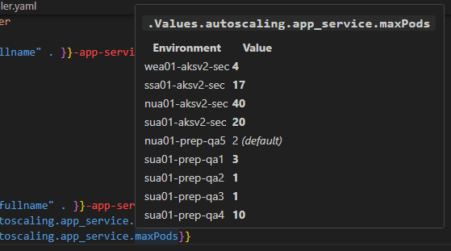

# Helm Values Navigator

VS Code extension for inspecting Helm values across environments. Hover over `.Values` references to see resolved values per environment; hover over `include` calls to see template definitions. Orphan diagnostics for unresolved refs and unused keys.

## Features

- **Values hover**: Hover over `.Values.x.y.z` in `templates/**/*.{yaml,yml,tpl}` → inline table of resolved values across all environments. Works in `{{ .Values.x }}`, `{{- if .Values.x }}`, `{{- with .Values.x }}`, etc. Values that differ from the base are **bold**; missing keys show `⚠ not set`.
- **Template definition hover**: Hover over `{{ include "template.name" . }}` → shows the `define` block source (file + full definition).
- **Orphan diagnostics**: Squiggly lines for `.Values` paths not defined in any values file (Error); hint for value keys not referenced in templates (Hint). Use `helmValues.excludeOrphanPrefixes` to suppress noisy paths.

## Supported layouts

- **Helmfile**: `helmfile.yaml` at workspace root with explicit `environments`. Value layers: chart base → env values → secrets → system.
- **Override-folder**: `helm/*/values.yaml` + `helm/*/overrides/*.yaml`. Environments inferred from override filenames.
- **Custom**: Set `helmValues.environments` and `helmValues.valuesFilePattern` to use explicit env list and a pattern like `values/values-{env}.yml`. Base path via `helmValues.valuesBasePath`. Takes precedence over helmfile/override-folder when both are set.

## Settings

| Setting | Description |
|---------|-------------|
| `helmValues.helmfilePath` | Path to helmfile.yaml (default: `helmfile.yaml`) |
| `helmValues.chartPath` | Override chart path when multiple charts exist (e.g. `nolo` or `helm/sample-gitops-2`) |
| `helmValues.baseValuesFile` | Base values filename relative to chart root (default: `values.yaml`) |
| `helmValues.overridesDir` | Overrides directory relative to chart root (override-folder layout, default: `overrides`) |
| `helmValues.secretsFilePath` | Override for git-ignored secrets file |
| `helmValues.environments` | Explicit env list. With `valuesFilePattern`, enables custom layout |
| `helmValues.valuesBasePath` | Base path for value files (default: `.`). Used with custom layout |
| `helmValues.valuesFilePattern` | Pattern with `{env}` placeholder (e.g. `values/values-{env}.yml`) |
| `helmValues.excludeOrphanPrefixes` | Path prefixes to exclude from orphan diagnostics (e.g. `["global.images"]`) |
| `helmValues.orphanDiagnosticsEnabled` | Enable/disable orphan diagnostics (default: `true`) |
